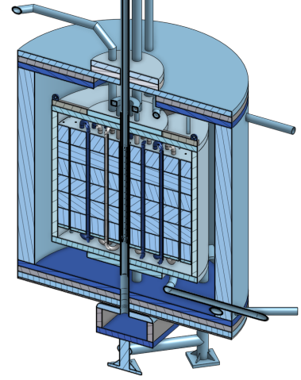
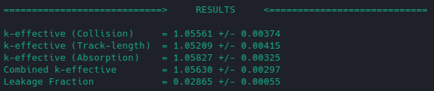
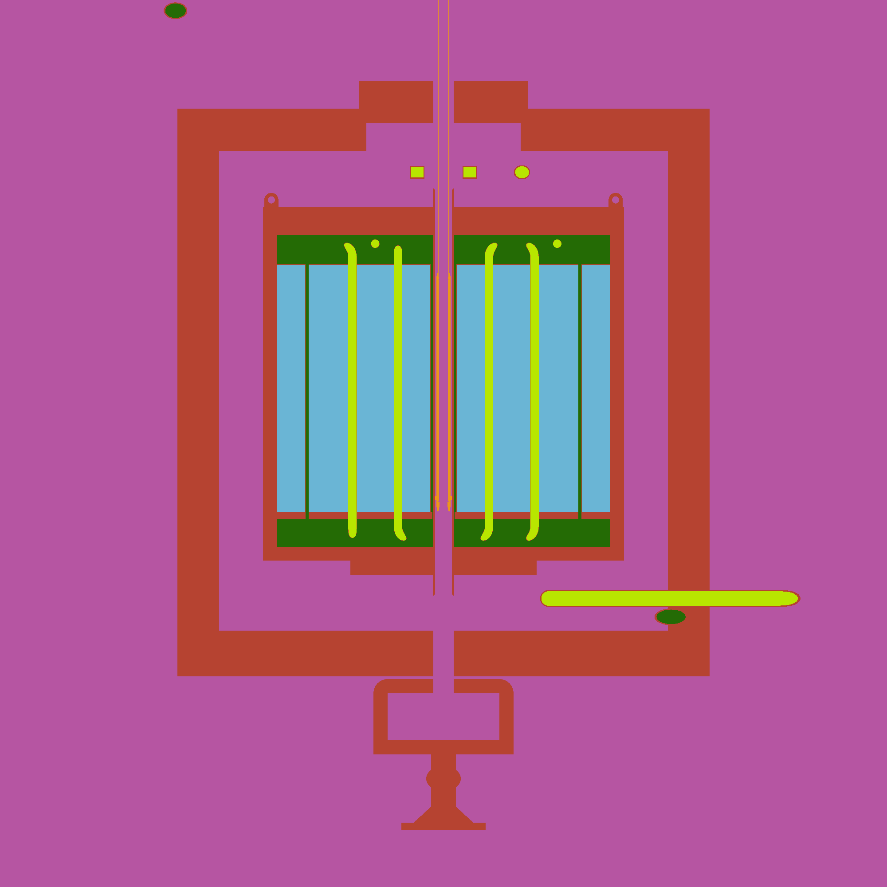
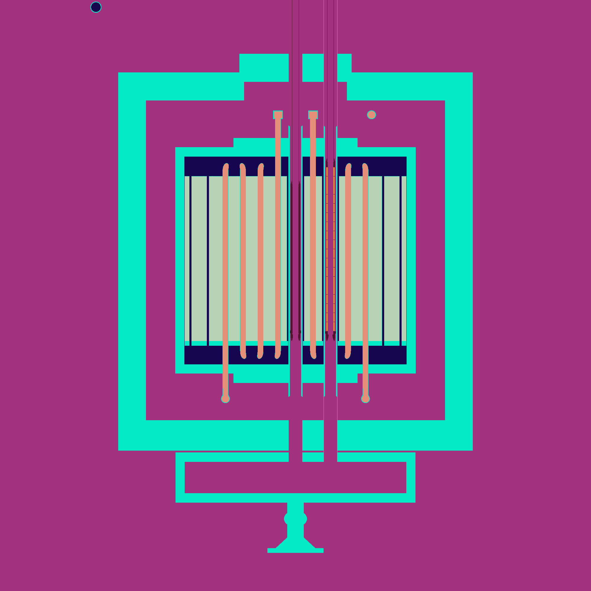

# are
[](https://www.gnu.org/licenses/gpl-3.0)

detailed cad model and simulations of the [are](https://en.wikipedia.org/wiki/Aircraft_Reactor_Experiment) (aircraft reactor experiment), operated by oak ridge national laboratory 1954

## model

### are core


[docs/are.pdf](docs/are.pdf) lists reference of the are core design, documented in the ornl reports and located in the repository [github.com/openmsr/msr-archive](https://github.com/openmsr/msr-archive/blob/master/README.md)

work-in-progress cad model of the are can be found [here](https://cad.onshape.com/documents/b83e5f739a4507bf06f2a2a9/w/9511a6ac44a9e4d439d86976/e/36d3d4af112bbf8cad7d521b?renderMode=0&uiState=62d907b3549a2247567bee8c) on onshape.

note that this work and the cad model is under the GNU General Public License v3.0

## prerequisites
### CAD_to_openMC
[CAD_to_openMC](https://github.com/openmsr/CAD_to_openMC) is an open-source package to convert CAD geometry (in the form of '.step' files) into an openmc-readable h5m file

### openmc
these simulations use [openmc](https://docs.openmc.org/en/stable/). automated source installation scripts for linux can be found [here](https://github.com/openmsr/openmc_install_scripts)

## simulation guide

first, clone the repository

```
git clone https://github.com/openmsr/are.git
```

enter the are folder and run the `run.sh` script

```
cd are
bash run.sh
```

which will show 

```
1) k eigenvalue          3) neutron flux          5) criticality approach  7) all
2) geometry plot         4) photon flux           6) shim rod calibration  8) quit
ARE simulations: 
```

enter a number to start the associated simulation or quit the prompt.

## results

sample results for each are shown below, and summarized separately [here](./results)

### k eigenvalue



### geometry plot

xz plane


yz plane
