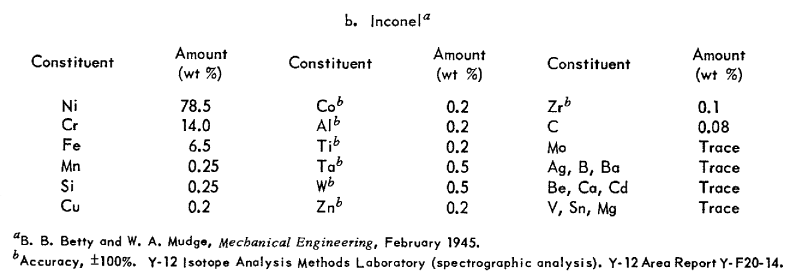
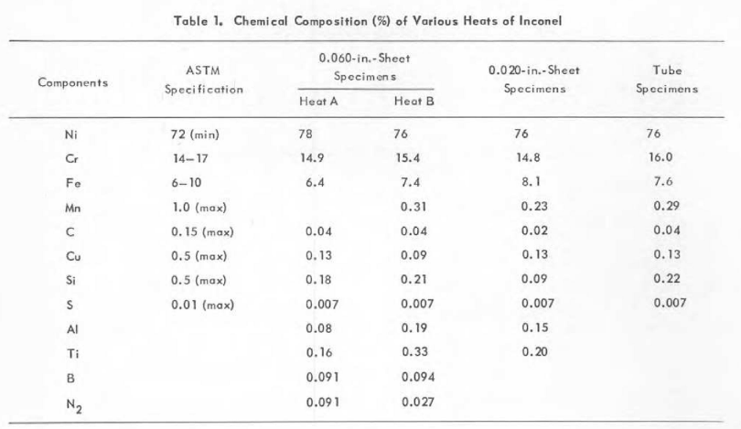

# criticality approach

the approach to criticality was a phase of the critical experiment (E-1) detailed in [ORNL-1845](https://github.com/openmsr/msr-archive/blob/master/docs/ORNL-1845.pdf). a description, detailed timeline, and all recorded data for the critical experiment can be found on pages 23-39. the critical experiment also included the calibration of the shim rods, the simulation results of which can be found in [here](./shim_rod_calibration.md). during the approach to criticality, successive additions of the fuel concentrate Na<sub>2</sub>-UF<sub>6</sub> (66.7-33.3 mol%) were added to the NaF-ZrF<sub>4</sub> (50-50 mol%) carrier until criticality was reached.

## data

### design, geometry & configuration 

[/design/are.pdf](/design/are.pdf) lists reference of the ARE core design, documented in the ornl reports and located in the repository [github.com/openmsr/msr-archive](https://github.com/openmsr/msr-archive/blob/master/README.md)

work-in-progress cad model of the ARE can be found [here](https://cad.onshape.com/documents/b83e5f739a4507bf06f2a2a9/w/9511a6ac44a9e4d439d86976/e/36d3d4af112bbf8cad7d521b?renderMode=0&uiState=62d907b3549a2247567bee8c) on onshape.

appendix D of [ORNL-1845](https://github.com/openmsr/msr-archive/blob/master/docs/ORNL-1845.pdf) describes: "With the safety rods completely withdrawn and the neutron source and fisssion chambers inserted, the fuel concentrate will be forced into the fuel circuit." the control rods will thus be fully withdrawn for the criticality approach experiment. neutron source and fission chamber parts are not included in the model due to lack of design information, and are assumed to be negligible materials with respect to steady state neutronics

the cad model is converted to an OpenMC-readable h5m file via the cubit-DAGMC toolchain. see [step_to_h5m_cubit.py](/scripts/step_to_h5m_cubit.py)


### materials 

all material definitions in OpenMC are consistent with material analysis and descriptions provided in the ORNL docs. instantiation and definitions of their respective `openmc.Material()` objects can be found in [initialize_materials.py](/scripts/initialize_materials.py). of particular importance to the steady-state neutronics are the fuel and inconel materials, which are discussed in more detail below.

#### fuel 

the circulating fuel consisted of a NaF-ZrF<sub>4</sub> (50-50 mol%) carrier mixed with a Na<sub>2</sub>-UF<sub>6</sub> (66.7-33.3 mol%) concentrate enriched to 93.40%(see [ORNL-1845](https://github.com/openmsr/msr-archive/blob/master/docs/ORNL-1845.pdf)  Appendix B) 


reactivity was measured for 12 different fuel compositions using two fission chambers and a BF<sub>3</sub> counter. detailed information on reactivity and fuel additions are given in tables 4.3 and 4.4 of [ORNL-1845](https://github.com/openmsr/msr-archive/blob/master/docs/ORNL-1845.pdf) on page 33 (shown below).


appendix B on page 113 of ORNL-1845 details the carrier composition as NaF-ZrF<sub>4</sub> (50-50 mol%) . the weight percentages for each run detailed below were derived from the above tables in conjunction with the carrier and concentrate compositions.

| run | Na (wt %) | F (wt %) | Zr (wt %) | U235 (wt %) | U238 (wt %) |
|-----|-----------|----------|-----------|-------------|-------------|
|  1  |   10.99   |   45.41  |   43.60   |    0.00     |    0.00     |
|  2  |   11.01   |   44.89  |   42.24   |    1.74     |    0.12     |
|  3  |   11.03   |   44.47  |   41.14   |    3.14     |    0.22     |
|  4  |   11.05   |   44.00  |   39.89   |    4.73     |    0.34     |
|  5  |   11.06   |   43.55  |   38.72   |    6.22     |    0.45     |
|  6  |   11.08   |   43.14  |   37.62   |    7.62     |    0.55     |
|  7  |   11.09   |   42.75  |   36.62   |    8.90     |    0.64     |
|  8  |   11.10   |   42.53  |   36.02   |    9.66     |    0.69     |
|  9  |   11.11   |   42.40  |   35.70   |   10.07     |    0.72     |
| 10  |   11.12   |   42.23  |   35.25   |   10.64     |    0.76     |
| 11  |   11.12   |   42.07  |   34.82   |   11.18     |    0.80     |
| 12  |   11.13   |   41.96  |   34.52   |   11.57     |    0.83     |

calculations for the above values are detailed [here](https://docs.google.com/spreadsheets/d/1RVwap77GXaVlIsbrXgNQTB-KTa4BvGLSgHnxRFQPmuA/edit?usp=sharing). note, weight percentages for U<sub>235</sub> agree with those in tables 4.3 and 4.4 of [ORNL-1845](https://github.com/openmsr/msr-archive/blob/master/docs/ORNL-1845.pdf) (see above). the data above along with densities taken directly from the ORNL tables are used as the material parameters for OpenMC. see below from [initialize_materials.py](/scripts/initialize_materials.py)
for reference 

```python
#fuel salt NaF-ZrF4-UF4 0.5309-0.4073-0.0618 %mol
salt = openmc.Material(name='salt', temperature = operating_temp)
salt.add_element('F',41.96,percent_type='wo')
salt.add_element('Na',11.13,percent_type='wo')
salt.add_element('Zr',34.52,percent_type='wo')
salt.add_nuclide('U235',11.57,percent_type='wo')
salt.add_nuclide('U238',11.57,percent_type='wo')
salt.set_density('g/cm3',3.3142201)
```

#### inconel

inconel makes up the large majority of the material in the ARE and the neutronics are thus sensitive to its composition. inconel composition is given in appendix B page 112 and shown below



as referenced in the footnotes of the table, the data is from a mechanical engineering textbook instead of on-site analysis. a structural analysis of inconel is documented in [ORNL-2264](https://github.com/openmsr/msr-archive/blob/master/docs/ORNL-2264.pdf) and was conducted for the purposes of a "prototype aircraft reactor test unit" (pg. 1), which refers to the Aircraft Reactor Test (ART). the structural analysis includes the chemical composition of the speciments tested (see below). 



an averaged composition of these specimens is used to define the composition of the inconel in this criticality approach experiment as it is assumed to be more accurate than the data given in appendix B of [ORNL-1845](https://github.com/openmsr/msr-archive/blob/master/docs/ORNL-1845.pdf) (above), and is consistent with the nominal composition of inconel 600. see below from [initialize_materials.py](/scripts/initialize_materials.py)
for reference 

```python
inconel = openmc.Material(name='inconel',temperature = operating_temp)
inconel.add_element('Ni',76.5,percent_type='wo')
inconel.add_element('Cr',15.275,percent_type='wo')
inconel.add_element('Fe',7.375,percent_type='wo')
inconel.add_element('Mn',0.2075,percent_type='wo')
inconel.add_element('C',0.035,percent_type='wo')
inconel.add_element('Cu',0.12,percent_type='wo')
inconel.add_element('Si',0.175,percent_type='wo')
inconel.add_element('S',0.007,percent_type='wo')
inconel.add_element('Al',0.105,percent_type='wo')
inconel.add_element('Ti',0.1725,percent_type='wo')
inconel.add_element('B',0.04625,percent_type='wo')
inconel.add_element('N',0.0295*2,percent_type='wo')

```


### operating temperature & thermal expansion     

[ORNL-1845](https://github.com/openmsr/msr-archive/blob/master/docs/ORNL-1845.pdf) page 23 describes "Both the sodium and the fuel system were at an isothermal temperature of 1300&deg;F". All materials are thus set to this temperature (977.5955&deg;K) in openmc.

to account for thermal expansion, the cad [model](https://cad.onshape.com/documents/b83e5f739a4507bf06f2a2a9/w/9511a6ac44a9e4d439d86976/e/36d3d4af112bbf8cad7d521b?renderMode=0&uiState=62d907b3549a2247567bee8c) is uniformly scaled, starting from the dimensions detailed [here](../design/are.pdf). the particular type of inconel used in the ARE is not provided in the documents, nor is any measurement of the linear thermal expansion coefficient $\lambda$. for the purposes of this simulation, it is assumed to be inconel 600 because at the time of the experiment (1954), only inconel 600 and 617 were available, and the nominal composition of inconel 600 is consistent with both appendix B of [ORNL-1845](https://github.com/openmsr/msr-archive/blob/master/docs/ORNL-1845.pdf) and the chemical analysis in in [ORNL-2264](https://github.com/openmsr/msr-archive/blob/master/docs/ORNL-2264.pdf). $\lambda$ is thus assumed to be $\sim$ $14.4*10^{-6} K^{-1}$ (see [here](https://www.hightempmetals.com/techdata/hitempInconel600data.php)). our scale factor for the model $s$ can therefore be expressed as $s = 1+\lambda T$


by a factor of $\sim$ 1.0154. this was calculated as $s= 1 + \alpha T$, where $s$ is the scale factor, $\alpha$ is the thermal expansion coefficient ( $K^{-1}$ ) of inconel extrapolated from [here](https://www.researchgate.net/publication/337709137_Thermophysical_properties_of_Inconel_718_alloy), and $T$ is the temperature in Kelvin. the coefficient for inconel was used because inconel makes up the majority of the core materials. however to account for differential expansion between the inconel and the BeO moderator, the Beryllium density was reduced in proportion to the scale factor.