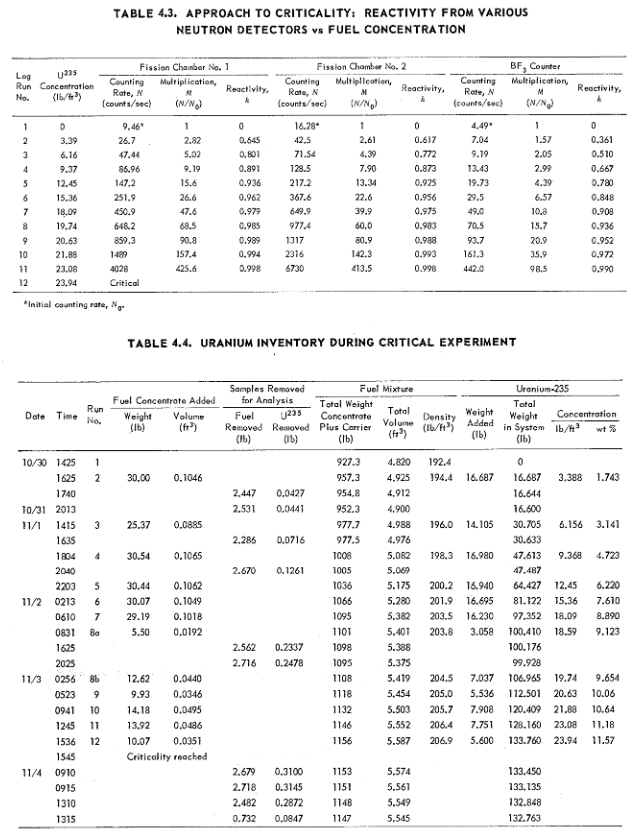

# criticality approach

the approach to criticality was a phase of the critical experiment (E-1) detailed in [ORNL-1845](https://github.com/openmsr/msr-archive/blob/master/docs/ORNL-1845.pdf). a description, detailed timeline, and all recorded data for the critical experiment can be found on pages 23-39. the critical experiment also included the calibration of the shim rods, the simulation results of which can be found in [here](./shim_rod_calibration.md). during the approach to criticality, successive additions of the fuel concentrate Na2-UF6 (66.7-33.3 mol%) were added to the NaF-ZrF4 (50-50 mol%) carrier until criticality was reached.

## data

### operating temperature & thermal expansion     

[ORNL-1845](https://github.com/openmsr/msr-archive/blob/master/docs/ORNL-1845.pdf) page 23 describes "Both the sodium and the fuel system were at an isothermal temperature of 1300&deg;F". All materials are thus set to this temperature (977.5955&deg;K) in openmc.

to account for thermal expansion, the cad [model](https://cad.onshape.com/documents/b83e5f739a4507bf06f2a2a9/w/9511a6ac44a9e4d439d86976/e/36d3d4af112bbf8cad7d521b?renderMode=0&uiState=62d907b3549a2247567bee8c) is uniformly scaled, starting from the dimensions detailed [here](../design/are.pdf), by a factor of $\sim$ 1.0154. this was calculated as $s= 1 + \alpha T$, where $s$ is the scale factor, $\alpha$ is the thermal expansion coefficient ( $K^{-1}$ ) of inconel extrapolated from [here](https://www.researchgate.net/publication/337709137_Thermophysical_properties_of_Inconel_718_alloy), and $T$ is the temperature in Kelvin. the coefficient for inconel was used because inconel makes up the majority of the core materials. however to account for differential expansion between the inconel and the BeO moderator, the Beryllium density was reduced in proportion to the scale factor.

### fuel compositions and reactivity

the circulating fuel consisted of a NaF-ZrF4 (50-50 mol%) carrier mixed with a Na2-UF6 (66.7-33.3 mol%) concentrate enriched to 93.40%(see [ORNL-1845](https://github.com/openmsr/msr-archive/blob/master/docs/ORNL-1845.pdf)  Appendix B) 

reactivity was measured for 12 different fuel compositions using two fission chambers and a BF$_3$ counter. detailed information on reactivity and fuel additions are given in tables 4.3 and 4.4 of [ORNL-1845](https://github.com/openmsr/msr-archive/blob/master/docs/ORNL-1845.pdf) on page 33 (shown below).

appendix B on page 113 of ORNL-1845 details the carrier composition as NaF-ZrF4 (50-50 mol%) . the weight percentages for each run detailed below were derived from the above tables in conjunction with the carrier and concentrate compositions.

| run | Na (wt %) | F (wt %) | Zr (wt %) | U235 (wt %) | U238 (wt %) |
|-----|-----------|----------|-----------|-------------|-------------|
|  1  |   10.99   |   45.41  |   43.60   |    0.00     |    0.00     |
|  2  |   10.85   |   44.83  |   42.24   |    1.95     |    0.14     |
|  3  |   10.74   |   44.36  |   41.14   |    3.51     |    0.25     |
|  4  |   10.61   |   43.83  |   39.89   |    5.29     |    0.38     |
|  5  |   10.49   |   43.33  |   38.72   |    6.96     |    0.50     |
|  6  |   10.37   |   42.87  |   37.62   |    8.52     |    0.61     |
|  7  |   10.27   |   42.44  |   36.62   |    9.96     |    0.71     |
|  8  |   10.21   |   42.19  |   36.02   |   10.81     |    0.77     |
|  9  |   10.18   |   42.05  |   35.70   |   11.27     |    0.81     |
| 10  |   10.13   |   41.86  |   35.25   |   11.91     |    0.85     |
| 11  |   10.09   |   41.68  |   34.82   |   12.52     |    0.90     |
| 12  |   10.06   |   41.55  |   34.52   |   12.95     |    0.93     |

calculations for the above values are detailed [here](https://docs.google.com/spreadsheets/d/1RVwap77GXaVlIsbrXgNQTB-KTa4BvGLSgHnxRFQPmuA/edit?usp=sharing). note, the calculated U235 wt % shown above is calculated using the amount of fuel concentrate added (in lbs), along with the composition of the conentrate (Na2-UF6 (66.7-33.3 mol%)), and the composition of the circulating fuel when it is added. 

there is a discrepancy between the calculated values and the recorded values in the final column of table 4.4 of ORNL-1845 (above). It appears that these recorded values were calculated by dividing the values in the "Total Weight in System (lb)" column for U235 by the values in the "Total Weight Concentrate Plus Carrier (lb)" column. By this method, the implicit weight percentage of U235 in the carrier is ~55%. Take the first addition of 30.00lb. The table shows that this results in addition of 16.687lbs of U235, and so we have $16.687/30.00 = 0.556$. In Appendix B however, it is stated explicitly that the fuel concentrate is Na2-UF6 (66.7-33.3 mol%) enriched to 93.40%. We can get the wt% of U235 from this formula as 

$$
M_{U_{235}}
$$