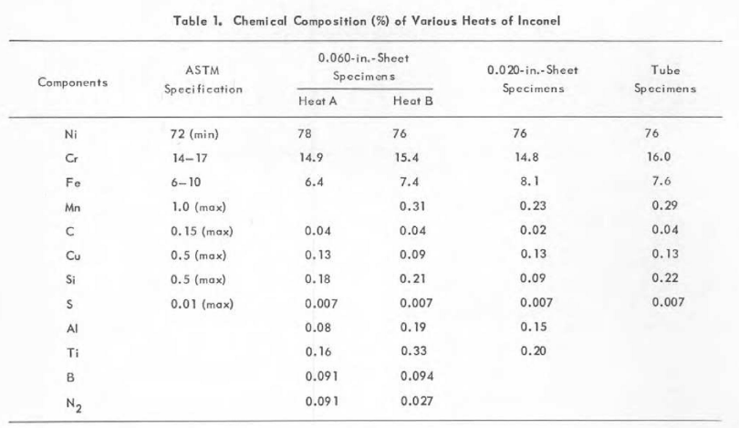
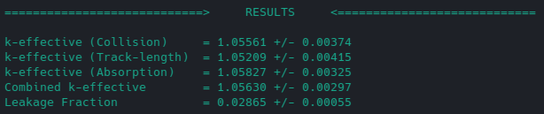

# k_effective

the [critical experiment](/results/criticality_approach.md) consisted of 12 fuel additions ending in criticality with fuel salt NaF-ZrF4-UF4 0.5309-0.4073-0.0618 %mol of density 3.3142201 g/cc. 

## data

### design, geometry & configuration

[/design/are.pdf](/design/are.pdf) lists reference of the ARE core design, documented in the ornl reports and located in the repository [github.com/openmsr/msr-archive](https://github.com/openmsr/msr-archive/blob/master/README.md)

work-in-progress cad model of the ARE can be found [here](https://cad.onshape.com/documents/b83e5f739a4507bf06f2a2a9/w/9511a6ac44a9e4d439d86976/e/36d3d4af112bbf8cad7d521b?renderMode=0&uiState=62d907b3549a2247567bee8c) on onshape.

appendix D of [ORNL-1845](https://github.com/openmsr/msr-archive/blob/master/docs/ORNL-1845.pdf) describes: "With the safety rods completely withdrawn and the neutron source and fisssion chambers inserted, the fuel concentrate will be forced into the fuel circuit." the control rods will thus be fully withdrawn for the k-effective simulation. neutron source and fission chamber parts are not included in the model due to lack of design information, and are assumed to be negligible materials with respect to steady state neutronics

the cad model is converted to an OpenMC-readable h5m file via the cubit-DAGMC toolchain. see [step_to_h5m_cubit.py](/scripts/step_to_h5m_cubit.py)

### materials

all material definitions in OpenMC are consistent with material analysis and descriptions provided in the ORNL docs. instantiation and definitions of their respective `openmc.Material()` objects can be found in [initialize_materials.py](/scripts/initialize_materials.py). of particular importance to the steady-state neutronics are the fuel, inconel and moderator materials, which are discussed in more detail below.

#### fuel

the circulating fuel consisted of a NaF-ZrF<sub>4</sub> (50-50 mol%) carrier mixed with a Na<sub>2</sub>-UF<sub>6</sub> (66.7-33.3 mol%) concentrate enriched to 93.40%(see [ORNL-1845](https://github.com/openmsr/msr-archive/blob/master/docs/ORNL-1845.pdf)  Appendix B)


fuel composition and other information at criticality are given in tables 4.3 and 4.4 of [ORNL-1845](https://github.com/openmsr/msr-archive/blob/master/docs/ORNL-1845.pdf) on page 33 (shown below).


additionally, [ORNL-4616](https://github.com/openmsr/msr-archive/blob/master/docs/ORNL-4616.pdf) states that the Zr in the ZrF4 contained < 50 ppm halfnium. Therefore, a Hf impurity of 25 ppm is assumed. see below from [fuel_salts.py](/scripts/initialize_materials.py)
for reference

```python
# halfnium concentration <50 ppm accoring to ORNL-4616, so 25 ppm assumed
h = 0.0025

#######################################################################
#fuel salt NaF-ZrF4-UF4 0.5309-0.4073-0.0618 %mol
salt = openmc.Material(name='salt', temperature = operating_temp)
salt.add_element('F',41.96,percent_type='wo')
salt.add_element('Na',11.13,percent_type='wo')
salt.add_element('Zr',34.52*(1.0-h),percent_type='wo')
salt.add_element('Hf',34.52*(h),percent_type='wo')
salt.add_nuclide('U235',11.57,percent_type='wo')
salt.add_nuclide('U238',0.83,percent_type='wo')
salt.set_density('g/cm3',3.3142201)
```

#### inconel

inconel makes up the large majority of the material in the ARE and the neutronics are thus sensitive to its composition. inconel composition is given in appendix B page 112 and shown below


as referenced in the footnotes of the table, the data is from a mechanical engineering textbook instead of on-site analysis. a structural analysis of inconel is documented in [ORNL-2264](https://github.com/openmsr/msr-archive/blob/master/docs/ORNL-2264.pdf) and was conducted for the purposes of a "prototype aircraft reactor test unit" (pg. 1), which refers to the Aircraft Reactor Test (ART). the structural analysis includes the chemical composition of the speciments tested (see below).



an averaged composition of these specimens is used to define the composition of the inconel in this criticality approach experiment as it is assumed to be more accurate than the data given in appendix B of [ORNL-1845](https://github.com/openmsr/msr-archive/blob/master/docs/ORNL-1845.pdf) (above), and is consistent with the nominal composition of inconel 600. see below from [initialize_materials.py](/scripts/initialize_materials.py)
for reference

```python
# from ORNL-2264 (average)
inconel.add_element('Ni',76.5,percent_type='wo')
inconel.add_element('Cr',15.275,percent_type='wo')
inconel.add_element('Fe',7.375,percent_type='wo')
inconel.add_element('Mn',0.2075,percent_type='wo')
inconel.add_element('C',0.035,percent_type='wo')
inconel.add_element('Cu',0.12,percent_type='wo')
inconel.add_element('Si',0.175,percent_type='wo')
inconel.add_element('S',0.007,percent_type='wo')
inconel.add_element('Al',0.105,percent_type='wo')
inconel.add_element('Ti',0.1725,percent_type='wo')
inconel.add_element('B',0.04625,percent_type='wo')
inconel.add_element('N',0.0295,percent_type='wo')
temp_adj = 1/(1+lambda_inconel*operating_temp)
inconel.set_density('g/cm3',8.5*temp_adj)
```

#### moderator (BeO)

moderator is defined as BeO with impurities given in appendix B of [ORNL-1845](https://github.com/openmsr/msr-archive/blob/master/docs/ORNL-1845.pdf) shown below


see below from [initialize_materials.py](/scripts/initialize_materials.py) for reference

```python
BeO = openmc.Material(name='BeO',temperature = operating_temp)

# by ao, expressed in ppm
BeO.add_element('Be',499792)
BeO.add_element('O',499792)

# impurities
BeO.add_element('Si',330)
BeO.add_element('Al',50)
BeO.add_element('Pb',25)
BeO.add_element('Ni',5)
BeO.add_element('Mn',5)
BeO.add_element('Co',1)
```


### operating temperature & thermal expansion     

[ORNL-1845](https://github.com/openmsr/msr-archive/blob/master/docs/ORNL-1845.pdf) page 23 describes "Both the sodium and the fuel system were at an isothermal temperature of 1300&deg;F". All materials are thus set to this temperature (977.5955&deg;K) in openmc.

to account for thermal expansion, the cad [model](https://cad.onshape.com/documents/b83e5f739a4507bf06f2a2a9/w/9511a6ac44a9e4d439d86976/e/36d3d4af112bbf8cad7d521b?renderMode=0&uiState=62d907b3549a2247567bee8c) is uniformly scaled, starting from the dimensions detailed [here](../design/are.pdf). As inconel makes up a large majority of the material in the core, the thermal expansion coefficient $\lambda$ of inconel is used for scaling. the particular type of inconel used in the ARE is not provided in the documents, nor is any measurement of the linear thermal expansion coefficient $\lambda$. for the purposes of this simulation, it is assumed to be inconel 600 because at the time of the experiment (1954), only inconel 600 and 617 were available, and the nominal composition of inconel 600 is consistent with both appendix B of [ORNL-1845](https://github.com/openmsr/msr-archive/blob/master/docs/ORNL-1845.pdf) and the chemical analysis in in [ORNL-2264](https://github.com/openmsr/msr-archive/blob/master/docs/ORNL-2264.pdf). $\lambda$ is thus assumed to be $\sim$ $14.4*10^{-6} K^{-1}$ (interpolated from [here](https://www.hightempmetals.com/techdata/hitempInconel600data.php)). our scale factor for the model $s$ can therefore be expressed as $s = 1+\lambda T = 1.014$, where $T$ is the temperature in Kelvin (977.5955&deg;K for this simulation).

as mentioned above, the fuel, inconel, and moderator materials are thought to be the most important with regard to the steady-state neutronics. the coefficient for inconel was used for the scale factor of the cad model because inconel makes up the majority of the core materials. however to account for differential expansion between the inconel and the BeO moderator, the Beryllium density was reduced in proportion to the difference in scale factors. no adjustment is made to the fuel densities, because the fuel will simply fill the volume of the inconel tubing, and there are empirical densities available for each run. the adjustment to the BeO density is detailed below:

```math
\lambda_{BeO} = 9.0*10^{-6} K^{-1}, \quad \lambda_{Inconel} = 14.4*10^{-6} K^{-1}, \quad \rho_{BeO} = 2.75 g/cm^3
```

```math
\rightarrow \rho_{adjusted} = \frac{1+\lambda_{BeO}T}{1+\lambda_{Inconel}T} \rho_{BeO} = 0.9948 \rho_{BeO}
```

see below from [initialize_materials.py](/scripts/initialize_materials.py) for reference

```python
# density with temperature and differential expansion adjustment
lambda_BeO = 9.0e-6
lambda_inconel = 14.4e-6
rho_0 = 2.75
temp_adj = rho_0/(1+lambda_BeO*operating_temp)
diff_exp_adj = (1+lambda_BeO*operating_temp)/(1+lambda_inconel*operating_temp)
BeO.set_density('g/cm3',rho_0*temp_adj*diff_exp_adj)
```

## results

results for a k_effective simulation using 100 batches (one inactive) of 1000 particles are shown below 

