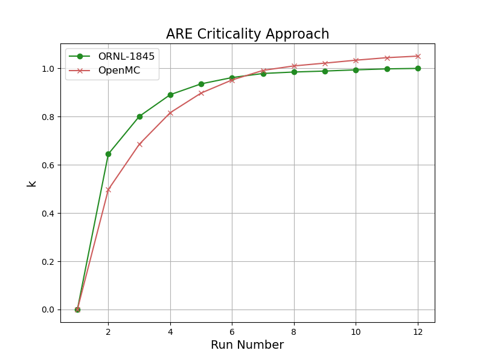

# shim rod calibration

shim rod calibrations were performed at each phase of the critical experiment (E-1) detailed in [ORNL-1845](https://github.com/openmsr/msr-archive/blob/master/docs/ORNL-1845.pdf). a description, detailed timeline, and all recorded data for the critical experiment can be found on pages 23-39. during the approach to criticality, successive additions of the fuel concentrate Na<sub>2</sub>-UF<sub>6</sub> (66.7-33.3 mol%) were added to the NaF-ZrF<sub>4</sub> (50-50 mol%) carrier until criticality was reached, see simulation results [here](./criticality_approach.md). Page 36 of [ORNL-1845](https://github.com/openmsr/msr-archive/blob/master/docs/ORNL-1845.pdf) describes "After each fuel addition, all three rods were simultaneously withdrawn to positions of 20, 25, 30, and 35 in. out; total movement was 36 in. The counting rate of each of the neutron detectors was recorded for each rod position." 

## data

### design, geometry & configuration

[/design/are.pdf](/design/are.pdf) lists reference of the ARE core design, documented in the ornl reports and located in the repository [github.com/openmsr/msr-archive](https://github.com/openmsr/msr-archive/blob/master/README.md)

work-in-progress cad model of the ARE can be found [here](https://cad.onshape.com/documents/b83e5f739a4507bf06f2a2a9/w/9511a6ac44a9e4d439d86976/e/36d3d4af112bbf8cad7d521b?renderMode=0&uiState=62d907b3549a2247567bee8c) on onshape.

the geometry configuration for OpenMC will have control rods, contianing Boron Carbide slugs, withdrawn as described above for each fuel composition. The stainless steel regulating rod will remain fully inserted. neutron source and fission chamber parts are not included in the model due to lack of design information, and are assumed to be negligible materials with respect to steady state neutronics

the cad model is converted to an OpenMC-readable h5m file via the cubit-DAGMC toolchain. see [step_to_h5m_cubit.py](/scripts/step_to_h5m_cubit.py)


### materials

all material definitions in OpenMC are consistent with material analysis and descriptions provided in the ORNL docs. instantiation and definitions of their respective `openmc.Material()` objects can be found in [initialize_materials.py](/scripts/initialize_materials.py). of particular importance to the steady-state neutronics are the fuel, inconel and moderator materials, which are discussed in more detail below.

#### fuel

the circulating fuel consisted of a NaF-ZrF<sub>4</sub> (50-50 mol%) carrier mixed with a Na<sub>2</sub>-UF<sub>6</sub> (66.7-33.3 mol%) concentrate enriched to 93.40%(see [ORNL-1845](https://github.com/openmsr/msr-archive/blob/master/docs/ORNL-1845.pdf)  Appendix B)


reactivity was measured for 12 different fuel compositions using two fission chambers and a BF<sub>3</sub> counter. detailed information on reactivity and fuel additions are given in tables 4.3 and 4.4 of [ORNL-1845](https://github.com/openmsr/msr-archive/blob/master/docs/ORNL-1845.pdf) on page 33 (shown below).



table 4.6 on pages 37-38, and shown below, detail the fuel compositions and reactivity measurements associated with each rod position. 


comparison of the "U<sup>235</sup> in system" column with that of tables 4.3 and 4.4 allows us to make the follwing mapping of from the fuel compositions of from the [criticality approach](./shim_rod_calibration.md) experiment to those of the shim rod calibration

| run (table 4.3)| run (table 4.6) | Na (wt %) | F (wt %) | Zr (wt %) | U235 (wt %) | U238 (wt %) |
|----------------|-----------------|-----------|----------|-----------|-------------|-------------|
|  8             |        8A       |   11.10   |   42.53  |   36.02   |    9.66     |    0.69     |
|  9             |        9B       |   11.11   |   42.40  |   35.70   |   10.07     |    0.72     |
| 10             |       10C       |   11.12   |   42.23  |   35.25   |   10.64     |    0.76     |
| 11             |       11C       |   11.12   |   42.07  |   34.82   |   11.18     |    0.80     |
| 12             |       12B       |   11.13   |   41.96  |   34.52   |   11.57     |    0.83     |


calculations for the above values -- using carrier and concentrate compositions combined with fuel concentrate added (in lbs) -- are detailed [here](https://docs.google.com/spreadsheets/d/1RVwap77GXaVlIsbrXgNQTB-KTa4BvGLSgHnxRFQPmuA/edit?usp=sharing). note, weight percentages for U<sub>235</sub> agree with those in tables 4.3 and 4.4 of [ORNL-1845](https://github.com/openmsr/msr-archive/blob/master/docs/ORNL-1845.pdf) (see above). the data above along with densities taken directly from the ORNL tables are used as the material parameters for OpenMC. 

additionally, [ORNL-4616](https://github.com/openmsr/msr-archive/blob/master/docs/ORNL-4616.pdf) describes "Normal commerical grades of zirconium compounds may contain from 1 to 3% halfnium as an impurity and would invoke a severe penalty in neutron economy if used in the MSRE. However, separation processes, based on an early development in the nuclear industry, are well known. Accordingly, zirconium tetraflouride that was essentially "halfnium free" (<50 ppm Hf) was available from commercial sources on a competative bid arrangement. a halfnium impurity of 0.0025% in the zirconium tetraflouride is therefore assumed, which corresponds to ~ 25 ppm. see below from [fuel_salts.py](/scripts/fuel_salts.py)
for reference

```python
# halfnium concentration <50 ppm accoring to ORNL-4616, so 25 ppm assumed
h = 0.0025

# 8A (ORNL-1845)
salt_8A = openmc.Material(name='salt', temperature = operating_temp)
salt_8A.set_density('g/cm3',3.27578)
salt_8A.add_element('Na',11.10,percent_type='wo')
salt_8A.add_element('Zr',36.02*(1.0-h),percent_type='wo')
salt_8A.add_element('Hf',36.02*(h),percent_type='wo')
salt_8A.add_element('F',42.53,percent_type='wo')
salt_8A.add_nuclide('U235',9.66,percent_type='wo')
salt_8A.add_nuclide('U238',0.69,percent_type='wo')

# 9B (ORNL-1845)
salt_9B = openmc.Material(name='salt', temperature = operating_temp)
salt_9B.set_density('g/cm3',3.28378)
salt_9B.add_element('Na',11.11,percent_type='wo')
salt_9B.add_element('Zr',35.70*(1.0-h),percent_type='wo')
salt_9B.add_element('Hf',35.70*(h),percent_type='wo')
salt_9B.add_element('F',42.40,percent_type='wo')
salt_9B.add_nuclide('U235',10.07,percent_type='wo')
salt_9B.add_nuclide('U238',0.72,percent_type='wo')

# 10C (ORNL-1845)
salt_10C = openmc.Material(name='salt', temperature = operating_temp)
salt_10C.set_density('g/cm3',3.29500)
salt_10C.add_element('Na',11.12,percent_type='wo')
salt_10C.add_element('Zr',35.25*(1.0-h),percent_type='wo')
salt_10C.add_element('Hf',35.25*(h),percent_type='wo')
salt_10C.add_element('F',42.23,percent_type='wo')
salt_10C.add_nuclide('U235',10.64,percent_type='wo')
salt_10C.add_nuclide('U238',0.76,percent_type='wo')

# 11C (ORNL-1845)
salt_11C = openmc.Material(name='salt', temperature = operating_temp)
salt_11C.set_density('g/cm3',3.30621)
salt_11C.add_element('Na',11.12,percent_type='wo')
salt_11C.add_element('Zr',34.82*(1.0-h),percent_type='wo')
salt_11C.add_element('Hf',34.82*(h),percent_type='wo')
salt_11C.add_element('F',42.07,percent_type='wo')
salt_11C.add_nuclide('U235',11.18,percent_type='wo')
salt_11C.add_nuclide('U238',0.80,percent_type='wo')

# 12B (ORNL-1845)
salt_12B = openmc.Material(name='salt', temperature = operating_temp)
salt_12B.set_density('g/cm3',3.3142201)
salt_12B.add_element('Na',11.13,percent_type='wo')
salt_12B.add_element('Zr',35.70*(1.0-h),percent_type='wo')
salt_12B.add_element('Hf',35.70*(h),percent_type='wo')
salt_12B.add_element('F',41.96,percent_type='wo')
salt_12B.add_nuclide('U235',11.57,percent_type='wo')
salt_12B.add_nuclide('U238',0.83,percent_type='wo')
```

#### inconel

inconel makes up the large majority of the material in the ARE and the neutronics are thus sensitive to its composition. inconel composition is given in appendix B page 112 and shown below


as referenced in the footnotes of the table, the data is from a mechanical engineering textbook instead of on-site analysis. a structural analysis of inconel is documented in [ORNL-2264](https://github.com/openmsr/msr-archive/blob/master/docs/ORNL-2264.pdf) and was conducted for the purposes of a "prototype aircraft reactor test unit" (pg. 1), which refers to the Aircraft Reactor Test (ART). the structural analysis includes the chemical composition of the speciments tested (see below).


an averaged composition of these specimens is used to define the composition of the inconel in this criticality approach experiment as it is assumed to be more accurate than the data given in appendix B of [ORNL-1845](https://github.com/openmsr/msr-archive/blob/master/docs/ORNL-1845.pdf) (above), and is consistent with the nominal composition of inconel 600. see below from [initialize_materials.py](/scripts/initialize_materials.py)
for reference

```python
# from ORNL-2264 (average)
inconel.add_element('Ni',76.5,percent_type='wo')
inconel.add_element('Cr',15.275,percent_type='wo')
inconel.add_element('Fe',7.375,percent_type='wo')
inconel.add_element('Mn',0.2075,percent_type='wo')
inconel.add_element('C',0.035,percent_type='wo')
inconel.add_element('Cu',0.12,percent_type='wo')
inconel.add_element('Si',0.175,percent_type='wo')
inconel.add_element('S',0.007,percent_type='wo')
inconel.add_element('Al',0.105,percent_type='wo')
inconel.add_element('Ti',0.1725,percent_type='wo')
inconel.add_element('B',0.04625,percent_type='wo')
inconel.add_element('N',0.0295,percent_type='wo')
temp_adj = 1/(1+lambda_inconel*operating_temp)
inconel.set_density('g/cm3',8.5*temp_adj)
```

#### moderator (BeO)

moderator is defined as BeO with impurities given in appendix B of [ORNL-1845](https://github.com/openmsr/msr-archive/blob/master/docs/ORNL-1845.pdf) shown below


see below from [initialize_materials.py](/scripts/initialize_materials.py) for reference

```python
BeO = openmc.Material(name='BeO',temperature = operating_temp)

# by ao, expressed in ppm
BeO.add_element('Be',499792)
BeO.add_element('O',499792)

# impurities
BeO.add_element('Si',330)
BeO.add_element('Al',50)
BeO.add_element('Pb',25)
BeO.add_element('Ni',5)
BeO.add_element('Mn',5)
BeO.add_element('Co',1)
```


### operating temperature & thermal expansion     

[ORNL-1845](https://github.com/openmsr/msr-archive/blob/master/docs/ORNL-1845.pdf) page 23 describes "Both the sodium and the fuel system were at an isothermal temperature of 1300&deg;F". All materials are thus set to this temperature (977.5955&deg;K) in openmc.

to account for thermal expansion, the cad [model](https://cad.onshape.com/documents/b83e5f739a4507bf06f2a2a9/w/9511a6ac44a9e4d439d86976/e/36d3d4af112bbf8cad7d521b?renderMode=0&uiState=62d907b3549a2247567bee8c) is uniformly scaled, starting from the dimensions detailed [here](../design/are.pdf). As inconel makes up a large majority of the material in the core, the thermal expansion coefficient $\lambda$ of inconel is used for scaling. the particular type of inconel used in the ARE is not provided in the documents, nor is any measurement of the linear thermal expansion coefficient $\lambda$. for the purposes of this simulation, it is assumed to be inconel 600 because at the time of the experiment (1954), only inconel 600 and 617 were available, and the nominal composition of inconel 600 is consistent with both appendix B of [ORNL-1845](https://github.com/openmsr/msr-archive/blob/master/docs/ORNL-1845.pdf) and the chemical analysis in in [ORNL-2264](https://github.com/openmsr/msr-archive/blob/master/docs/ORNL-2264.pdf). $\lambda$ is thus assumed to be $\sim$ $14.4*10^{-6} K^{-1}$ (interpolated from [here](https://www.hightempmetals.com/techdata/hitempInconel600data.php)). our scale factor for the model $s$ can therefore be expressed as $s = 1+\lambda T = 1.014$, where $T$ is the temperature in Kelvin (977.5955&deg;K for this simulation).

as mentioned above, the fuel, inconel, and moderator materials are thought to be the most important with regard to the steady-state neutronics. the coefficient for inconel was used for the scale factor of the cad model because inconel makes up the majority of the core materials. however to account for differential expansion between the inconel and the BeO moderator, the Beryllium density was reduced in proportion to the difference in scale factors. no adjustment is made to the fuel densities, because the fuel will simply fill the volume of the inconel tubing, and there are empirical densities available for each run. the adjustment to the BeO density is detailed below:

```math
\lambda_{BeO} = 9.0*10^{-6} K^{-1}, \quad \lambda_{Inconel} = 14.4*10^{-6} K^{-1}, \quad \rho_{BeO} = 2.75 g/cm^3
```

```math
\rightarrow \rho_{adjusted} = \frac{1+\lambda_{BeO}T}{1+\lambda_{Inconel}T} \rho_{BeO} = 0.9948 \rho_{BeO}
```

see below from [initialize_materials.py](/scripts/initialize_materials.py) for reference

```python
# density with temperature and differential expansion adjustment
lambda_BeO = 9.0e-6
lambda_inconel = 14.4e-6
rho_0 = 2.75
temp_adj = rho_0/(1+lambda_BeO*operating_temp)
diff_exp_adj = (1+lambda_BeO*operating_temp)/(1+lambda_inconel*operating_temp)
BeO.set_density('g/cm3',rho_0*temp_adj*diff_exp_adj)
```

## results

using parameters and material definitions provided above, 11 k-eigenvalue simulations are run; one for each of the 11 fuel compositions and compared with the experimental values. results are shown in the figure and associated table below


| run | k (ORNL-1845) | k (OpenMC) | $\Delta$ (%)  |
|-----|---------------|------------|---------------|
|  1  |   0.000       |   0.000    |  0.00         |
|  2  |   0.361       |   0.500    |  38.5         |
|  3  |   0.510       |   0.690    |  35.2         |
|  4  |   0.667       |   0.819    |  22.8         |
|  5  |   0.780       |   0.901    |  15.5         |
|  6  |   0.848       |   0.956    |  12.7         |
|  7  |   0.908       |   0.993    |  9.36         |
|  8  |   0.936       |   1.014    |  8.33         |
|  9  |   0.952       |   1.025    |  7.67         |
| 10  |   0.972       |   1.037    |  6.69         |
| 11  |   0.990       |   1.047    |  5.76         |
| 12  |   1.000       |   1.053    |  5.30         |